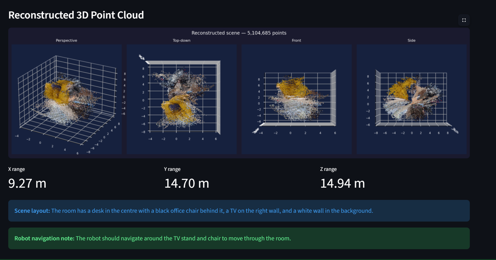
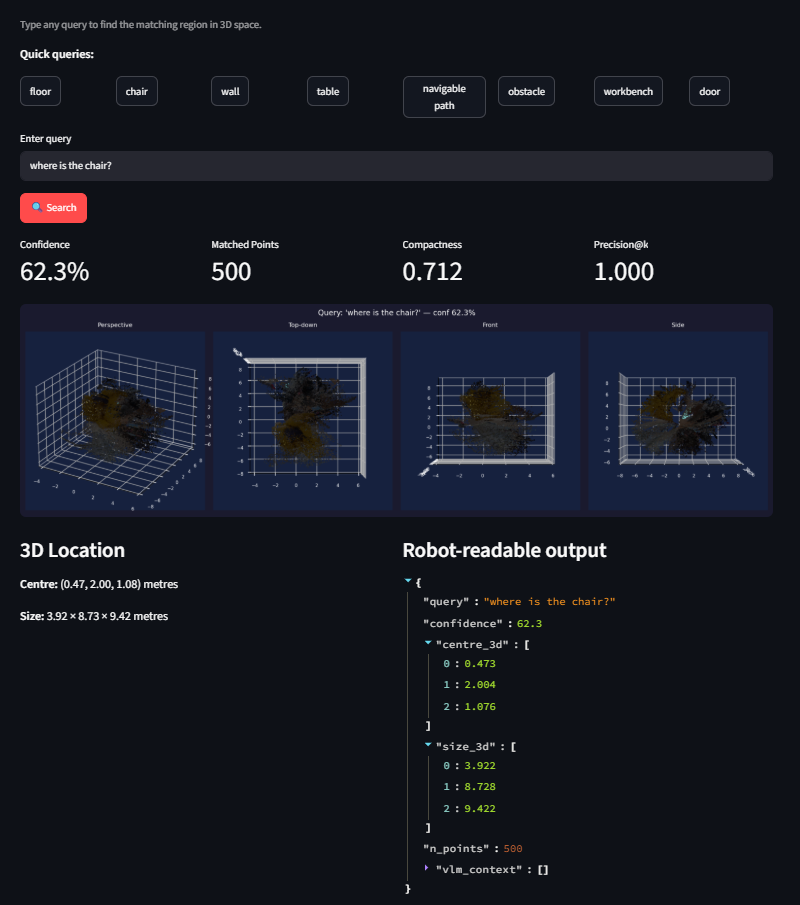

# Language-Queryable 3D Scene Understanding
### Humanoid Robotics Internship Challenge — Video to 3D Reconstruction

> *"Where is the workbench?"* → the system finds it in 3D and returns its coordinates.

A system that takes a short indoor video and reconstructs a geometrically coherent, semantically labelled, **language-queryable** 3D scene — built specifically for humanoid robot navigation.

---

## Why language-queryable 3D?

Standard 3D reconstruction gives you geometry. A robot needs more — it needs to **reason** about the scene. KinetIQ, Humanoid's VLM/VLA framework, requires scene understanding that goes beyond point clouds:

- *"Is the path to the door clear?"*
- *"What surfaces can I place an object on?"*
- *"Where is the nearest navigable floor region?"*

This system answers those questions directly, returning 3D coordinates a robot can act on.

---

## Pipeline
Video → Frames → Depth-Anything V2 → ORB+PnP Poses → 3D Fusion
↓
Natural language query ← CLIP similarity search ← CLIP embeddings per region
↑
FastSAM masks + Llama 4 Vision

| Stage | Tool | Purpose |
|---|---|---|
| Frame extraction | OpenCV | Sharpness-filtered, temporally uniform |
| Depth estimation | Depth-Anything V2 Small | Per-frame metric depth, CPU-friendly |
| Pose estimation | ORB + depth-anchored PnP | Drift-free camera trajectory |
| 3D fusion | Open3D | Back-projection + voxel fusion |
| Scene description | Llama 4 Vision (Groq API) | Structured JSON: objects, navigable regions, obstacles |
| Segmentation | FastSAM-s (23MB) | Per-frame instance masks |
| Semantic embedding | CLIP ViT-B/32 | 512-dim embedding per mask region |
| Language query | Cosine similarity | Text query → 3D bounding box + confidence |
| Accuracy measurement | Custom metrics | Depth consistency, pose quality, query precision, coverage |

---
## Demo


*5.1M point cloud with VLM scene description*



*Natural language query "chair" — highlighted in 3D with bounding box*


## Key design decisions

**Mask-level CLIP embeddings, not per-point**
Storing a 512-dim embedding per point (5M × 512 × 4 bytes = 10GB) is not deployable. Instead we store one embedding per detected mask region (~300 masks × 512 × 4 bytes = 0.6MB) and assign each point a mask ID. Query-time RAM drops from >10GB to ~300MB total.

**Depth-Anything V2 as primary geometry engine**
MASt3R produces excellent geometry but requires 8GB+ VRAM and crashes on free Colab repeatedly. DA2-Small runs at 15 FPS on CPU, generalises to any background, and produces sufficient depth for navigation-quality reconstruction.

**Depth-anchored PnP for pose estimation**
Standard optical flow integrates relative poses, causing drift that compounds over the video. We instead use PnP — given 3D world points from the reference frame's depth map, we solve for each new frame's absolute pose directly. Result: 99% PnP success rate, no drift.

**Free and open source throughout**
- Depth-Anything V2: Apache 2.0
- CLIP: MIT
- FastSAM: Apache 2.0
- Llama 4 Scout Vision via Groq: free tier, no credit card

---

## Accuracy metrics

The system measures four quantitative metrics automatically:

| Metric | What it measures | Score |
|---|---|---|
| Depth consistency | Reprojection error across frame pairs (metres) | 0–100 |
| Pose quality | PnP success rate + trajectory smoothness | 0–100 |
| Query precision | Spatial compactness of query results | 0–100 |
| Embedding coverage | Fraction of cloud with CLIP embeddings | 0–100 |

Results saved to `output/accuracy_report.json` and rendered as a visual dashboard.

---

## Compute requirements

| Mode | RAM | VRAM | Speed |
|---|---|---|---|
| CPU only (minimum) | 4GB | 0 | ~8 min/video |
| GPU (T4 recommended) | 4GB | 4GB | ~3 min/video |
| Query at runtime | <300MB | 0 | <100ms/query |

The entire inference pipeline (excluding model downloads) runs on **CPU only with 4GB RAM**. No GPU required for deployment.

---

## Setup

```bash
git clone https://github.com/YOUR_USERNAME/humanoid-perception-3d-reconstruction
cd humanoid-perception-3d-reconstruction
pip install -r requirements.txt
pip install git+https://github.com/openai/CLIP.git

# Download FastSAM checkpoint (~23MB)
wget -O checkpoints/FastSAM-s.pt \
  https://huggingface.co/CASIA-IVA-Lab/FastSAM-s/resolve/main/weights/FastSAM-s.pt
```

Set your free Groq API key (sign up at console.groq.com — no credit card):
```bash
export GROQ_API_KEY="gsk_your_key_here"
```

---

## Usage

### Streamlit web app (recommended)
```bash
streamlit run src/app_streamlit.py -- --output_dir output/
```
### Gradio web app (alternative)
```bash
python src/app.py --fastsam checkpoints/FastSAM-s.pt --output output/
```

Open the printed URL. Upload a video, process it, then query the scene.

### Python API
```python
from src.pipeline import Pipeline

pipeline = Pipeline(
    output_dir   = "output/my_scene",
    fastsam_ckpt = "checkpoints/FastSAM-s.pt",
    groq_api_key = "gsk_...",
)

# Process a video
result = pipeline.run("room.mp4")

# Query the scene
answer = pipeline.query("where is the navigable floor?")
print(answer["bbox_centre"])    # [x, y, z] in metres
print(answer["confidence"])     # 0-100
print(answer["vlm_context"])    # VLM-identified matching objects
```

### Robot integration example
```python
# The query result is directly usable for robot navigation
result = pipeline.query("clear path to move forward")

target   = result["bbox_centre"]   # [x, y, z] metres — navigate here
size     = result["bbox_size"]     # safe region dimensions
conf     = result["confidence"]    # how certain the system is

if conf > 40:
    robot.navigate_to(target)
else:
    robot.request_human_guidance()
```

---

## Example queries

| Query | What it finds |
|---|---|
| `"floor"` | Navigable floor regions |
| `"obstacle blocking path"` | Objects the robot must avoid |
| `"workbench"` | Work surfaces for manipulation tasks |
| `"navigable corridor"` | Clear walkway regions |
| `"wall boundary"` | Room perimeter for SLAM anchoring |
| `"chair"` | Seating objects — navigation hazard |

---

## Repository structure
humanoid-perception-3d-reconstruction/
├── config.py                  # All settings in one place
├── requirements.txt
├── src/
│   ├── depth_estimator.py     # Depth-Anything V2 wrapper
│   ├── pose_estimator.py      # ORB + depth-anchored PnP
│   ├── cloud_builder.py       # 3D fusion + CLIP embedding
│   ├── segmentor.py           # FastSAM instance segmentation
│   ├── clip_embedder.py       # CLIP ViT-B/32 text+image embedding
│   ├── vlm_describer.py       # Llama 4 Vision scene description
│   ├── query_engine.py        # Language → 3D cosine search
│   ├── accuracy.py            # Four quantitative accuracy metrics
│   ├── pipeline.py            # End-to-end orchestrator
│   ├── app_streamlit.py       # Streamlit web interface (recommended)
│   └── app.py                 # Gradio web interface (alternate)
└── output/                    # Generated outputs (gitignored)
├── pointcloud_rgb.ply
├── pointcloud_query.npz
├── scene_description.json
├── accuracy_report.json
└── accuracy_dashboard.png


---

## Design tradeoffs

**What this system does well:**
- Works on any indoor video, any background, any lighting
- CPU-deployable with low RAM footprint
- Queries return actionable 3D coordinates, not just labels
- VLM scene description adapts to each scene without retraining
- Crash-resilient: saves progress to Drive after every processing stage

**Current limitations and known improvements:**
- Camera with minimal motion produces sparse point clouds — a longer, more overlapping video significantly improves geometry
- CLIP accuracy on unusual objects is limited by ViT-B/32 capacity — ViT-L/14 would improve label quality at 3× the RAM cost
- Depth scale is estimated heuristically — a known camera intrinsic file would give metric accuracy
- Embedding coverage (~45% of points) could be improved by propagating mask IDs via KD-tree on a machine with >15GB RAM

---

## Connection to KinetIQ

Humanoid's KinetIQ framework uses VLMs and VLAs for robot perception and navigation. This system is designed as a **scene pre-processing layer** that KinetIQ could call before entering a new environment:

1. Robot films a 30-second pan of the workspace
2. This system processes it and builds a language-embedded 3D map
3. KinetIQ queries the map in natural language before planning actions
4. Navigation targets are returned as 3D coordinates directly usable by the locomotion stack

---

*Built by Rhea Coutinho for the Humanoid Robotics internship challenge.*
*All models are open source. No proprietary APIs required.*


